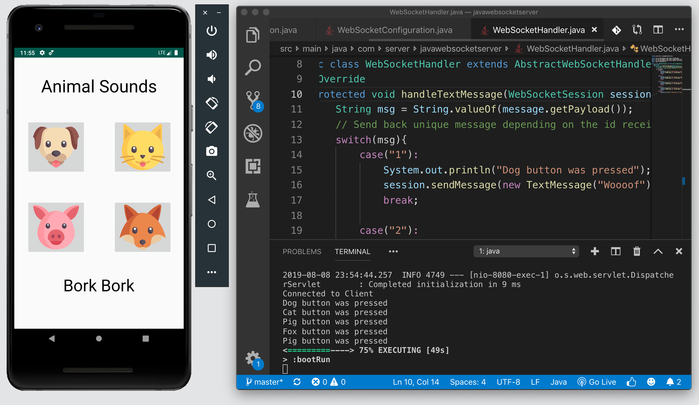
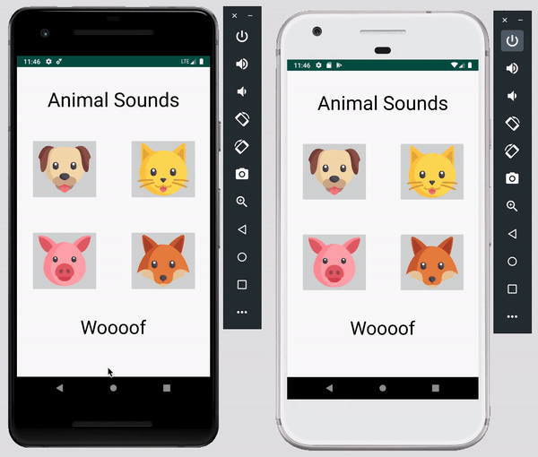

# Java WebSocket Programming | Android and Spring Boot

A simple demo on how to set up an Android Client that connects to a WebSocket server using [Spring Boot](https://spring.io/projects/spring-boot). For the client-to-client demo, we use [PubNub's Android SDK](https://www.pubnub.com/docs/android-java/pubnub-java-sdk) to securely and reliably send data between clients without setting up a server.

## Setup
1) Sign up for a free PubNub account to get your Pub/Sub API keys.

 <a href="https://dashboard.pubnub.com/signup?devrel_gh=java-websocket-demo">
    
  </a>

2) Clone the repo.
```bash
git clone https://github.com/ocastroa/java-websocket-demo
```
3) To run the client-to-server demo, open the directory **JavaWebSocketClient** in Android Studio and **javawebsocketserver** in your favorite text editor, like [VS Code](https://code.visualstudio.com/download) 

4) To start the server, go to the root directory of **javawebsocketserver** in your terminal and type the following command:
```bash
gradle bootRun
```
5) Run the client on the Android emulator. Once the app opens, click any of the four buttons and see the response from the server in the text below the buttons.

<p align="center">
  
</p>

6) To run the client-to-client demo, open the directory **PubNubJavaClient** in Android Studio. Go to MainActivity.java and replace 'ENTER_YOUR_PUB_KEY' and 'ENTER_YOUR_SUB_KEY' with the keys you got from Step 1.

7) Run the cient on two different emulators. Click any of the buttons and watch as mesages are published to both emulators.

<p align="center">
  
</p>


## Build Your Own WebSocket Demo with Android and Spring Boot

To learn more about this project or if you want to build this project from scratch, check out the tutorial.

  <a href="https://www.pubnub.com/blog/java-websocket-programming-with-android-and-spring-boot/?devrel_gh=java-websocket-demo">
    
  </a>
